### 👩‍💻 Sobre Mim

Olá! Sou a Sabrinna, desenvolvedora focada em construir soluções **robustas, escaláveis e sustentáveis** ao longo do tempo.  
Meu trabalho é guiado por princípios sólidos de **Engenharia de Software**, com atenção especial à arquitetura, clareza de código e manutenibilidade.

Tenho interesse genuíno em entender o *porquê* das decisões técnicas, não apenas o *como*, buscando sempre evoluir minhas práticas e visão de sistema.

* 🔭 **Atualmente focada em:** Desenvolvimento Fullstack (.NET & React/Next.js)  
* 🧠 **Mentalidade:** Clean Code, SOLID, Design Patterns  
* 💬 **Interesses:** Arquitetura de software, performance e UI/UX funcional  
* 🌱 **Em aprendizado contínuo:** Arquiteturas modernas e cloud  

---

### 🛠️ Skills Técnicas

| Linguagens & Frameworks | Ferramentas & Ambientes |
|------------------------|------------------------|
|  |  |

---

### 🏗️ Projetos & Laboratório

Atualmente estou estruturando meus primeiros repositórios públicos, com foco em:

* **APIs robustas e seguras** utilizando .NET  
* **Aplicações web modernas e responsivas** com Next.js  
* **Boilerplates e templates** seguindo boas práticas de arquitetura  

> [!NOTE]
> Os repositórios serão publicados em breve.  
> Estou priorizando qualidade, clareza arquitetural e documentação técnica detalhada, incluindo exemplos reais de uso.

---

### 📊 Estatísticas no GitHub

<table align="center">
  <tr>
    <td align="center">
      
    </td>
    <td align="center">
      
    </td>
  </tr>
</table>

  

---

### 📫 Vamos Conversar?

Se você busca trocar conhecimento técnico, colaborar em projetos ou discutir arquitetura e boas práticas, fique à vontade para entrar em contato.

  
  

---

  <i>"A simplicidade é o último grau da sofisticação."</i>

